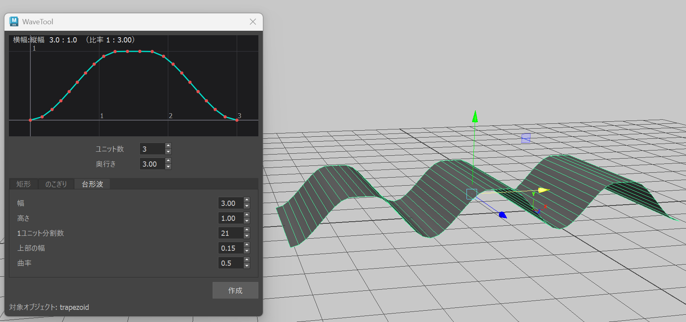
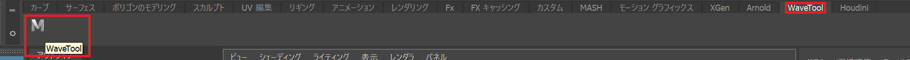
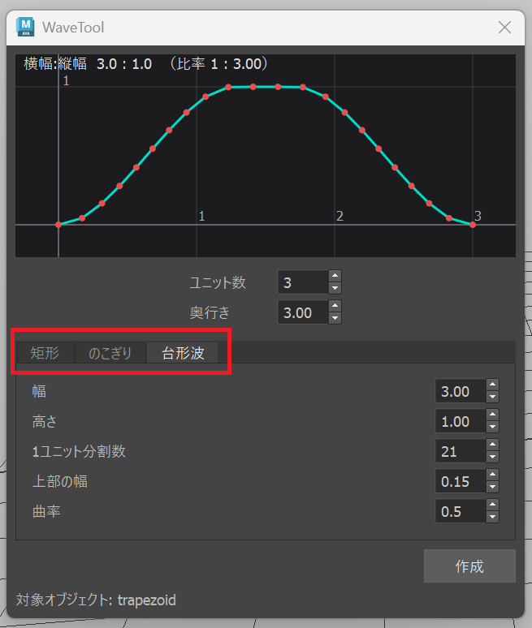
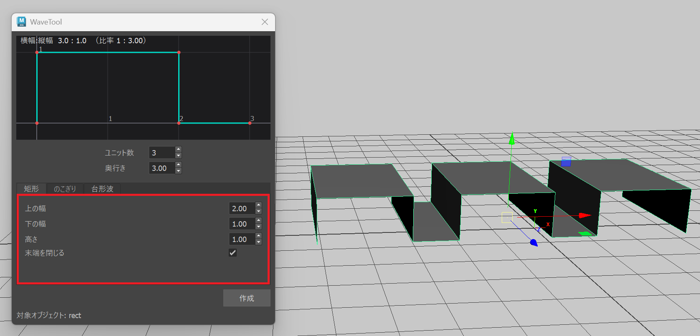
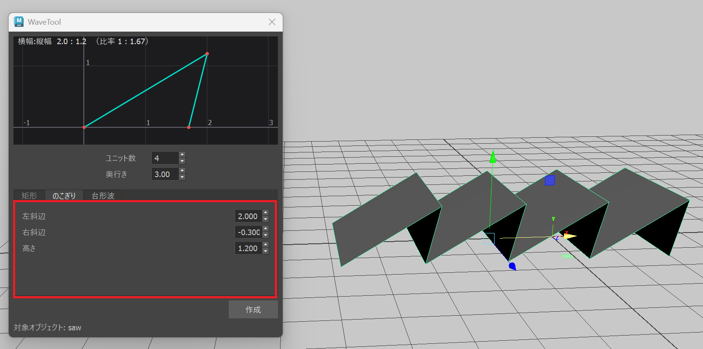
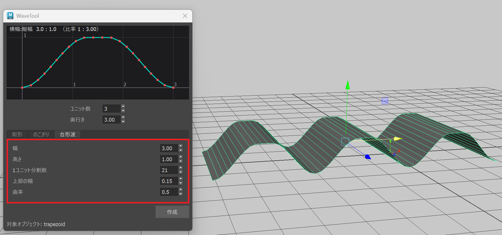

# WaveMeshTool-MayaPlugin

## 概要


**WaveMeshTool** は、Maya上で波形状のポリゴンメッシュを生成するためのプラグインです。  
矩形波・のこぎり波・台形波など、様々な波形パターンを簡単に作成でき、**リアルタイムプレビュー**を見ながらパラメータを調整できます。

---

## 導入方法

### 1. ダウンロード
GitHubリポジトリから最新版のzipファイルをダウンロードしてください。

### 2. ファイルの配置
ダウンロードしたファイルを以下のパスに配置します：

```
C:\Users\<ユーザー名>\Documents\maya\<バージョン>\modules
```

---

### A. modulesフォルダが存在しない場合

1. ダウンロードした `modules` フォルダをそのまま上記のパスに配置してください。  
2. フォルダ構成は以下のようになります：

```
C:\Users\<ユーザー名>\Documents\maya\2026\
└─ modules/
   ├─ wave_tool.mod
   └─ wave_tool/
      ├─ __init__.py
      ├─ framework/
      ├─ ui/
      └─ setup/
```

---

### B. modulesフォルダが既に存在する場合

1. ダウンロードした `modules` フォルダを開きます。  
2. 中にある `wave_tool.mod` ファイルと `wave_tool` フォルダを取り出します。  
3. 既存の `modules` フォルダ内に配置してください。

```
C:\Users\<ユーザー名>\Documents\maya\2026\
└─ modules/
   ├─ (既存のファイル...)
   ├─ wave_tool.mod          ← 追加
   └─ wave_tool/             ← 追加
      ├─ __init__.py
      ├─ framework/
      ├─ ui/
      └─ setup/
```

---

### 3. Maya起動
Mayaを起動（既に起動している場合は再起動）すると、プラグインが自動的に読み込まれます。

### 4. シェルフボタンの確認

Maya起動後、「WaveTool」という名前のカスタムシェルフが自動的に作成されます。  
シェルフ上に「**WaveTool**」ボタンが表示されていれば、インストール成功です。

---

## 使い方

### 1. ツールを開く

シェルフの「**WaveTool**」ボタンをクリックしてください。

### 2. 波形タイプを選択


ツール上部のタブから作成したい波形を選びます：

- **矩形**：矩形波（長方形を繰り返すパターン）  
- **のこぎり**：のこぎり波（三角形の繰り返しパターン）  
- **台形波**：台形波（滑らかな曲線の波形）

---

### 3. パラメータ調整

#### 共通パラメータ

| パラメータ名 | 説明 |
|--------------|------|
| ユニット数 | 波形の繰り返し回数（1～100） |
| 奥行き | メッシュのZ方向の長さ（0.1～100.0） |

#### 矩形波パラメータ


- 上の幅  
- 下の幅  
- 高さ  
- 末端を閉じる

#### のこぎり波パラメータ


- 左斜辺  
- 右斜辺  
- 高さ  

#### 台形波パラメータ


- 幅（1ユニットあたりの幅）  
- 高さ  
- 1ユニット分割数  
- 上部の幅  
- 曲率

---

### 4. リアルタイムプレビュー
パラメータを変更すると、ツール上部の**プレビューウィンドウ**に波形が表示されます。  
グリッド線とラベルで寸法を確認できます。

---

### 5. メッシュ作成
「**作成**」ボタンをクリックすると、Mayaシーン内にポリゴンメッシュが生成されます。  
作成後にパラメータを変更すると、**メッシュも自動的に更新**されます。

> ツール下部に作成されたオブジェクト名が表示されます。

---

### 6. メッシュ編集
作成されたメッシュは通常のMayaポリゴンオブジェクトです。  
移動・回転・スケールなどの変形操作が可能で、パラメータ変更時もトランスフォームは保持されます。

---

## 動作環境

| 項目 | 内容 |
|------|------|
| 対応バージョン | Maya 2025 / 2026 |
| 使用技術 | PySide6 |
| 注意事項 | Maya 2024以前では動作しません。 |

---
